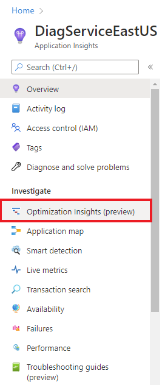

# Optimization Insights service (private preview)

Performance bugs are consistently difficult to detect in today’s online services, since they:

- Don’t cause system failure. 
- Are dependent on user input.
- In some cases, only manifest with specific inputs.
- Can be introduced by anyone, even experts.
- Propagate easily by code reuse.  

To detect performance bugs and provide insights in your application, Optimization Insights relies on an AI model. This AI-based service identifies and removes CPU and memory bottlenecks by:

- Analyzing the runtime behavior of your application.
- Comparing the behavior analysis to performance engineering best practices.

Optimization Insights service is built entirely using Azure. Behind the scenes, our system's smart-sampling agent grabs samples from the profiles captured on your app every *X* minutes. These samples are then sent to the AI model to extract the most relevant insights and recommendations.  

## Pre-requisites

Before you can use Optimization Insights on your Azure resource, [enable the Application Insights Profiler](https://docs.microsoft.com/en-us/azure/azure-monitor/app/profiler-overview).

## Navigate to Optimization Insights

Once you've been onboarded to the private preview, you'll notice the new **Optimization Insights (preview)** tab from your resource's profiler page. Navigate to that tab to view the insights we've identified in your application over the last 24 hours.

From your Azure Application Insights resource overview page, select **Optimization Insights (preview)** under **Investigate** in the left navigation pane.

You can sort the insights based on:

- Extra memory or CPU usage (impact).
- Issue frequency within a specific time period (count).
- Role, if your service has multiple roles.

Select each insight to view:

- Detailed description of the performance bug insight.
- Recommendations on how to fix the performance issue.

Access the full call stack surrounding the performance issue via the call stack button.

## Difference between Application Insights and Optimization Insights

Microsoft's Application Insights Profiler and Optimization Insights work together to provide a holistic approach to performance issue detection.

### Application Insights

Application Insights focuses on tracing specific requests, down to the millisecond. It provides an excellent "big picture" view of issues within your application and general best practices to address them.

### Optimization Insights

Optimization Insights draws from Application Insights, requiring you to have your profiler enabled in order to take advantage of Optimization Insights. On top of the big picture provided by Application Insights, Optimization Insights:

- Displays aggregated data gathered over time.
- Connects data with the methods and functions in your application code.
- Narrows down on the culprit for bottle-necking within the code.

## Next Steps

- For more information, review our [FAQ page](README.md#frequently-asked-questions).
- If you have any further questions, email the [Optimization Insights team](mailto:opt_insights@microsoft.com).
